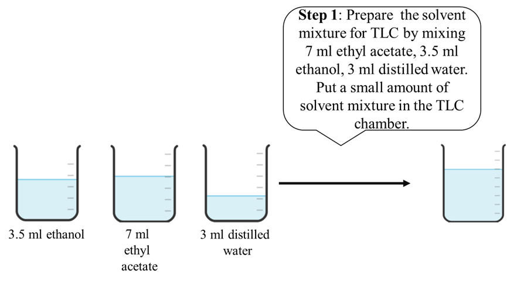

5. <b>Procedure</b>  
<b>5.1. Materials & Reagents Required: </b> 
1	TLC chamber  
2	Forceps(tweezers) 
3	Micro capillary tubes 
4	Ink sample  
5	Mobile phase solvent: Ethyl acetate + Ethanol + distilled water (70:35:30) 
6	TLC plates 
7	Graphite pencils. 
<b>5.2. Procedure in laboratory (diagram)</b> 
<centre></centre>  
<centre></centre>  
<centre></centre>  
<centre></centre>  
<centre></centre>  
<b>5.3. Procedure in laboratory</b> 
<centre></centre>  
<centre></centre>  
<centre>See video!</ccentre>  
<b>5.4. Data and the analysis</b> 
<centre></centre>  
<b>5.5. Procedure in simulator of the experiment</b> 