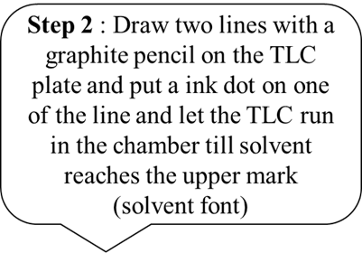

5. Procedure
5.1. Materials & Reagents Required:  
1)	TLC chamber  
2)	Forceps(tweezers) 
3)	Micro capillary tubes 
4)	Ink sample  
5)	Mobile phase solvent: Ethyl acetate + Ethanol + distilled water (70:35:30) 
6)	TLC plates 
7)	Graphite pencils. 
5.2. Procedure in laboratory (diagram) 
 
 
 
 
 
5.3. Procedure in laboratory 
 
 
See video!  
5.4. Data and the analysis 
 
5.5. Procedure in simulator of the experiment 