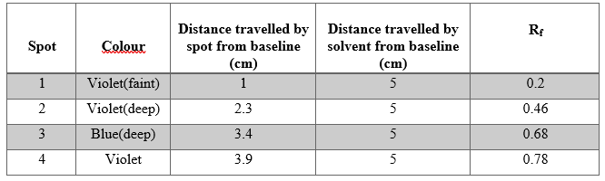

<b> Materials & Reagents Required: </b> 
1	TLC chamber  
2	Forceps(tweezers) 
3	Micro capillary tubes 
4	Ink sample  
5	Mobile phase solvent: Ethyl acetate + Ethanol + distilled water (70:35:30) 
6	TLC plates 
7	Graphite pencils  
<b>  Procedure in laboratory (diagram)</b> 
<centre></centre>  
<centre></centre>  
<centre></centre>  
<centre></centre>  
<centre></centre>  
<b> Procedure in laboratory</b> 
<centre></centre>  
<centre></centre>  
<b> Data and the analysis</b> 
<centre></centre>
